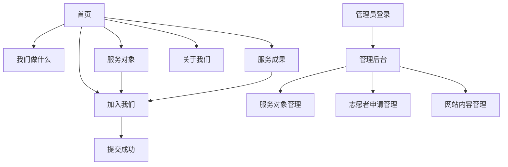

## 1. 产品概述

乡助桥是一个连接大学生志愿者与留守老人和儿童的公益平台。通过一对一认领服务模式，让乡村留守者获得持续的情感陪伴和实际帮助，解决农村留守群体缺乏关爱和支持的社会问题。

目标用户包括：大学生志愿者、留守老人、留守儿童及其家庭、乡镇政府管理人员。平台致力于建立可持续的志愿服务生态系统，提升农村社会福利水平。

## 2. 核心功能

### 2.1 用户角色

| 角色    | 注册方式   | 核心权限                       |
| ----- | ------ | -------------------------- |
| 志愿者   | 在线表单注册 | 浏览服务对象、认领陪伴对象、提交服务记录       |
| 乡镇管理员 | 后台账号分配 | 添加/编辑服务对象信息、查看统计数据、管理志愿者申请 |
| 访客    | 无需注册   | 浏览公开信息、查看服务成果              |

### 2.2 功能模块

乡助桥平台包含以下核心页面：

1. **首页**：展示平台使命、核心数据、快速入口
2. **我们做什么**：详细介绍服务内容和服务流程
3. **服务对象**：展示待认领的留守老人和儿童信息列表
4. **服务成果**：展示服务数据统计和成功案例
5. **加入我们**：志愿者注册表单和认领流程
6. **关于我们**：团队介绍和联系方式
7. **管理员登录**：后台管理系统入口
8. **管理后台**：服务对象管理、志愿者申请管理、数据统计

### 2.3 页面详情

| 页面名称  | 模块名称    | 功能描述                                             |
| ----- | ------- | ------------------------------------------------ |
| 首页    | 导航栏     | 包含5个主要页面入口，统一导航体验                                |
| 首页    | 大标题区    | 展示"乡助桥——让乡村留守者不再孤单"主标语                           |
| 首页    | 核心数据    | 动态显示已走访村庄数、已服务人数、已陪伴小时数                          |
| 首页    | 行动按钮    | "我要认领服务对象"跳转至服务对象页，"我要成为志愿者"跳转至加入页面              |
| 首页    | 照片墙     | 展示3-4张服务调研照片，支持点击查看大图                            |
| 首页    | 浏览计数器   | 实时显示网站访问量和独立访客数                                  |
| 首页    | 底部栏     | 显示联系方式、隐私政策链接                                    |
| 我们做什么 | 服务介绍    | 分别介绍留守儿童和老人服务的具体内容                               |
| 我们做什么 | 服务流程    | 展示调研建档→线上匹配→服务→记录→优化的完整流程                        |
| 我们做什么 | 服务承诺    | 承诺完全免费、隐私保护、长期陪伴                                 |
| 服务对象  | 列表展示    | 表格形式展示待认领服务对象信息，包含编号、类型、年龄、所在村、基本情况、主要需求、状态      |
| 服务对象  | 认领功能    | 每行提供"我要认领"按钮，点击跳转至加入页面并自动填充对象编号                  |
| 服务成果  | 数据看板    | 展示累计服务人次、累计陪伴小时、覆盖村庄数                            |
| 服务成果  | 案例展示    | 展示服务前后对比的真实案例                                    |
| 服务成果  | 志愿者感言   | 展示2-3条志愿者服务反馈                                    |
| 加入我们  | 报名表单    | 包含姓名、学院/专业、联系方式、可服务时间、认领对象编号、申请理由等字段             |
| 加入我们  | 表单提交    | 数据发送至指定邮箱，提交成功后显示成功提示                            |
| 关于我们  | 团队介绍    | 展示项目负责人、运营负责人、技术负责人、指导老师信息                       |
| 关于我们  | 联系方式    | 显示邮箱<2339832360@qq.com>、电话15228883259、地址宜宾学院临港校区 |
| 管理员登录 | 登录表单    | 提供账号密码输入，验证xiangzhuqiao/xiangzhuqiao             |
| 管理后台  | 服务对象管理  | 支持添加、编辑、删除留守老人和儿童信息                              |
| 管理后台  | 志愿者申请管理 | 查看和处理志愿者申请信息                                     |
| 管理后台  | 网站内容管理  | 支持修改首页背景图、服务瞬间照片、更新核心数据                          |
| 管理后台  | 数据统计    | 查看访问量、认领情况、服务进展等统计数据                             |

## 3. 核心流程

### 访客浏览流程

访客访问首页 → 浏览服务内容 → 查看服务对象 → 决定成为志愿者 → 填写申请表单 → 提交成功

### 志愿者认领流程

志愿者访问服务对象页 → 选择合适对象 → 点击认领 → 跳转至加入页面（自动填充对象编号）→ 完善个人信息 → 提交申请 → 等待审核

### 管理员操作流程

管理员登录 → 进入管理后台 → 添加服务对象信息 → 处理志愿者申请 → 更新服务数据 → 管理网站内容

## 4. 用户界面设计

### 4.1 设计风格

* **主色调**：志愿者红色系（深酒红色 #8B0000 作为主色，搭配浅红色 #DC143C）

* **辅助色**：白色用于文字和背景对比，浅灰色用于次要信息

* **按钮样式**：圆角矩形设计，主要按钮使用红色背景配白色文字

* **字体**：无衬线字体，标题使用加粗字体，正文使用常规字体

* **布局风格**：卡片式布局，顶部固定导航栏，内容区域左右分栏

* **图标风格**：使用简洁的线性图标，配合emoji表情增加亲和力

### 4.2 页面设计概述

| 页面名称 | 模块名称  | UI元素                                  |
| ---- | ----- | ------------------------------------- |
| 首页   | 导航栏   | 深酒红色背景，白色文字，logo在左侧，导航菜单居中，志愿者申请按钮在右侧 |
| 首页   | 大标题区  | 左侧对齐的大标题"让乡村留守者不再孤单"，使用白色加粗字体，背景为深酒红色 |
| 首页   | 核心数据  | 使用大号数字配合描述文字，红色数字突出显示                 |
| 首页   | 行动按钮  | 红色背景的圆角按钮，白色文字，悬停时颜色加深                |
| 首页   | 照片墙   | 三张照片并排显示，圆角边框，点击时弹出大图查看               |
| 首页   | 浏览计数器 | 右下角显示，使用红色小图标配合数字                     |
| 服务对象 | 信息表格  | 白色背景，红色表头，斑马纹行背景，认领按钮使用红色             |
| 服务成果 | 数据看板  | 使用大号数字卡片设计，红色边框突出显示                   |
| 加入我们 | 报名表单  | 白色输入框，红色边框聚焦效果，必填项用红色星号标记             |
| 管理后台 | 管理界面  | 左侧深色侧边栏，右侧白色内容区域，表格形式展示数据             |

### 4.3 响应式设计

* **桌面优先**：主要针对桌面端用户优化，确保大屏幕下的最佳体验

* **移动端适配**：支持平板和手机访问，导航菜单在小屏幕下转换为汉堡菜单

* **触摸优化**：按钮和链接具有足够的点击区域，适合触摸操作

### 4.4 交互设计

* **页面切换**：平滑的页面过渡动画

* **按钮反馈**：点击按钮时有视觉反馈效果

* **表单验证**：实时验证用户输入，错误提示使用红色文字

* **加载状态**：数据加载时显示旋转加载图标

* **成功提示**：操作成功后显示绿色提示信息

