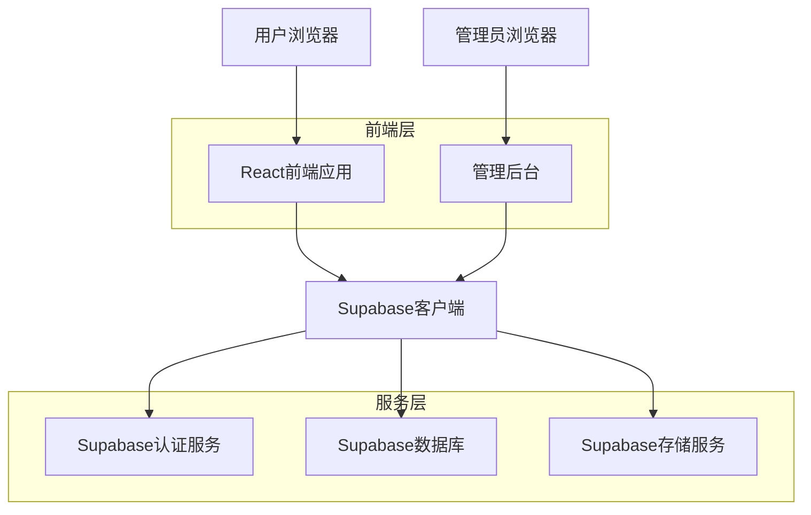
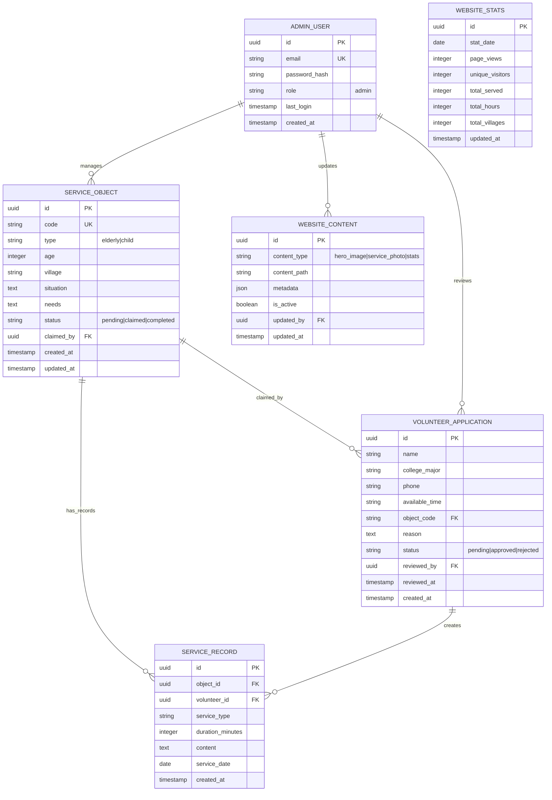

## 1. 架构设计



## 2. 技术描述

- **前端框架**: React@18 + TypeScript + Vite
- **初始化工具**: vite-init
- **UI框架**: TailwindCSS@3 + HeadlessUI
- **状态管理**: React Context + useReducer
- **后端服务**: Supabase (BaaS)
- **认证服务**: Supabase Auth
- **数据库**: Supabase PostgreSQL
- **文件存储**: Supabase Storage
- **邮件服务**: Supabase Edge Functions + SMTP

## 3. 路由定义

| 路由路径 | 页面用途 |
|----------|----------|
| / | 首页，展示平台核心信息和服务入口 |
| /what-we-do | 我们做什么页面，详细介绍服务内容 |
| /service-objects | 服务对象页面，展示待认领的留守群体 |
| /achievements | 服务成果页面，展示数据统计和成功案例 |
| /join-us | 加入我们页面，志愿者注册表单 |
| /about-us | 关于我们页面，团队介绍和联系方式 |
| /admin/login | 管理员登录页面 |
| /admin/dashboard | 管理后台首页 |
| /admin/service-objects | 服务对象管理页面 |
| /admin/volunteers | 志愿者申请管理页面 |
| /admin/content | 网站内容管理页面 |
| /admin/statistics | 数据统计页面 |

## 4. API定义

### 4.1 认证相关API

```typescript
// 管理员登录
POST /auth/v1/token?grant_type=password

请求体:
{
  email: string;    // 管理员邮箱
  password: string; // 管理员密码
}

响应:
{
  access_token: string;
  refresh_token: string;
  user: {
    id: string;
    email: string;
    role: 'admin';
  };
}
```

### 4.2 服务对象管理API

```typescript
// 获取服务对象列表
GET /rest/v1/service-objects

查询参数:
- status?: 'pending' | 'claimed' | 'completed'
- type?: 'elderly' | 'child'
- village?: string

响应:
{
  data: ServiceObject[];
  count: number;
}

// 添加服务对象
POST /rest/v1/service-objects

请求体:
{
  code: string;        // 编号如S001
  type: 'elderly' | 'child';
  age: number;
  village: string;
  situation: string;   // 基本情况
  needs: string;       // 主要需求
  status: 'pending';
}

// 更新服务对象
PATCH /rest/v1/service-objects?id=eq.{id}

// 删除服务对象
DELETE /rest/v1/service-objects?id=eq.{id}
```

### 4.3 志愿者申请管理API

```typescript
// 获取志愿者申请列表
GET /rest/v1/volunteer-applications

查询参数:
- status?: 'pending' | 'approved' | 'rejected'

响应:
{
  data: VolunteerApplication[];
  count: number;
}

// 更新申请状态
PATCH /rest/v1/volunteer-applications?id=eq.{id}

请求体:
{
  status: 'approved' | 'rejected';
  reviewed_by: string;
  reviewed_at: string;
}
```

### 4.4 网站统计API

```typescript
// 获取网站访问统计
GET /rest/v1/website-stats

响应:
{
  total_visits: number;
  unique_visitors: number;
  today_visits: number;
  service_stats: {
    total_served: number;
    total_hours: number;
    total_villages: number;
  };
}

// 记录页面访问
POST /rest/v1/page-views

请求体:
{
  page_path: string;
  visitor_id: string;
  timestamp: string;
}
```

## 5. 数据模型

### 5.1 实体关系图



### 5.2 数据定义语言

```sql
-- 创建服务对象表
CREATE TABLE service_objects (
    id UUID PRIMARY KEY DEFAULT gen_random_uuid(),
    code VARCHAR(20) UNIQUE NOT NULL,
    type VARCHAR(10) CHECK (type IN ('elderly', 'child')) NOT NULL,
    age INTEGER CHECK (age > 0 AND age < 150),
    village VARCHAR(100) NOT NULL,
    situation TEXT NOT NULL,
    needs TEXT NOT NULL,
    status VARCHAR(20) DEFAULT 'pending' CHECK (status IN ('pending', 'claimed', 'completed')),
    claimed_by UUID REFERENCES service_objects(id),
    created_at TIMESTAMP WITH TIME ZONE DEFAULT NOW(),
    updated_at TIMESTAMP WITH TIME ZONE DEFAULT NOW()
);

-- 创建志愿者申请表
CREATE TABLE volunteer_applications (
    id UUID PRIMARY KEY DEFAULT gen_random_uuid(),
    name VARCHAR(50) NOT NULL,
    college_major VARCHAR(100) NOT NULL,
    phone VARCHAR(20) NOT NULL,
    available_time VARCHAR(50) NOT NULL,
    object_code VARCHAR(20) REFERENCES service_objects(code),
    reason TEXT,
    status VARCHAR(20) DEFAULT 'pending' CHECK (status IN ('pending', 'approved', 'rejected')),
    reviewed_by UUID,
    reviewed_at TIMESTAMP WITH TIME ZONE,
    created_at TIMESTAMP WITH TIME ZONE DEFAULT NOW()
);

-- 创建服务记录表
CREATE TABLE service_records (
    id UUID PRIMARY KEY DEFAULT gen_random_uuid(),
    object_id UUID REFERENCES service_objects(id) ON DELETE CASCADE,
    volunteer_id UUID REFERENCES volunteer_applications(id) ON DELETE CASCADE,
    service_type VARCHAR(50) NOT NULL,
    duration_minutes INTEGER CHECK (duration_minutes > 0),
    content TEXT NOT NULL,
    service_date DATE NOT NULL,
    created_at TIMESTAMP WITH TIME ZONE DEFAULT NOW()
);

-- 创建管理员用户表
CREATE TABLE admin_users (
    id UUID PRIMARY KEY DEFAULT gen_random_uuid(),
    email VARCHAR(255) UNIQUE NOT NULL,
    password_hash VARCHAR(255) NOT NULL,
    role VARCHAR(20) DEFAULT 'admin' CHECK (role = 'admin'),
    last_login TIMESTAMP WITH TIME ZONE,
    created_at TIMESTAMP WITH TIME ZONE DEFAULT NOW()
);

-- 创建网站内容管理表
CREATE TABLE website_content (
    id UUID PRIMARY KEY DEFAULT gen_random_uuid(),
    content_type VARCHAR(50) CHECK (content_type IN ('hero_image', 'service_photo', 'stats')) NOT NULL,
    content_path TEXT NOT NULL,
    metadata JSONB,
    is_active BOOLEAN DEFAULT true,
    updated_by UUID REFERENCES admin_users(id),
    updated_at TIMESTAMP WITH TIME ZONE DEFAULT NOW()
);

-- 创建网站统计表
CREATE TABLE website_stats (
    id UUID PRIMARY KEY DEFAULT gen_random_uuid(),
    stat_date DATE UNIQUE NOT NULL,
    page_views INTEGER DEFAULT 0,
    unique_visitors INTEGER DEFAULT 0,
    total_served INTEGER DEFAULT 0,
    total_hours INTEGER DEFAULT 0,
    total_villages INTEGER DEFAULT 0,
    updated_at TIMESTAMP WITH TIME ZONE DEFAULT NOW()
);

-- 创建页面访问记录表
CREATE TABLE page_views (
    id UUID PRIMARY KEY DEFAULT gen_random_uuid(),
    page_path VARCHAR(255) NOT NULL,
    visitor_id VARCHAR(255) NOT NULL,
    timestamp TIMESTAMP WITH TIME ZONE DEFAULT NOW()
);

-- 创建索引
CREATE INDEX idx_service_objects_code ON service_objects(code);
CREATE INDEX idx_service_objects_status ON service_objects(status);
CREATE INDEX idx_service_objects_type ON service_objects(type);
CREATE INDEX idx_volunteer_applications_status ON volunteer_applications(status);
CREATE INDEX idx_volunteer_applications_phone ON volunteer_applications(phone);
CREATE INDEX idx_service_records_object_id ON service_records(object_id);
CREATE INDEX idx_service_records_volunteer_id ON service_records(volunteer_id);
CREATE INDEX idx_service_records_service_date ON service_records(service_date);
CREATE INDEX idx_page_views_timestamp ON page_views(timestamp);
CREATE INDEX idx_page_views_visitor_id ON page_views(visitor_id);
CREATE INDEX idx_website_stats_date ON website_stats(stat_date);

-- 设置访问权限
GRANT SELECT ON service_objects TO anon;
GRANT SELECT ON website_content TO anon;
GRANT SELECT ON website_stats TO anon;

GRANT ALL PRIVILEGES ON service_objects TO authenticated;
GRANT ALL PRIVILEGES ON volunteer_applications TO authenticated;
GRANT ALL PRIVILEGES ON service_records TO authenticated;
GRANT ALL PRIVILEGES ON website_content TO authenticated;
GRANT ALL PRIVILEGES ON website_stats TO authenticated;
GRANT ALL PRIVILEGES ON page_views TO authenticated;

-- 插入初始管理员账号（密码：xiangzhuqiao）
INSERT INTO admin_users (email, password_hash) VALUES 
('xiangzhuqiao@admin.com', '$2b$10$YourHashedPasswordHere');

-- 插入初始统计数据
INSERT INTO website_stats (stat_date, total_served, total_hours, total_villages) VALUES 
(CURRENT_DATE, 156, 2340, 12);
```

### 5.3 Supabase安全策略

```sql
-- 服务对象读取策略（允许匿名访问）
CREATE POLICY "service_objects_read_policy" ON service_objects
    FOR SELECT USING (true);

-- 服务对象管理策略（仅管理员）
CREATE POLICY "service_objects_manage_policy" ON service_objects
    FOR ALL USING (auth.jwt() ->> 'role' = 'admin');

-- 志愿者申请写入策略（允许所有用户）
CREATE POLICY "volunteer_applications_insert_policy" ON volunteer_applications
    FOR INSERT WITH CHECK (true);

-- 志愿者申请管理策略（仅管理员）
CREATE POLICY "volunteer_applications_manage_policy" ON volunteer_applications
    FOR ALL USING (auth.jwt() ->> 'role' = 'admin');

-- 网站内容管理策略（仅管理员）
CREATE POLICY "website_content_manage_policy" ON website_content
    FOR ALL USING (auth.jwt() ->> 'role' = 'admin');

-- 统计数据读取策略（允许匿名访问）
CREATE POLICY "website_stats_read_policy" ON website_stats
    FOR SELECT USING (true);
```